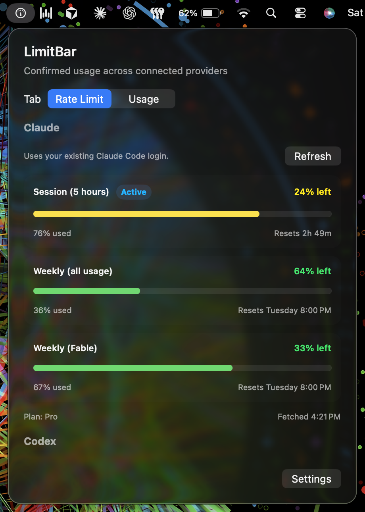

# LimitBar

A free macOS menu bar app for AI coding usage from Claude Code, Codex, Azure OpenAI, Anthropic, OpenAI, and local tools you configure.
LimitBar stores its settings and normalized metrics locally and requires no LimitBar account, cloud sync, or telemetry.
Opening the Claude rate-limit view with an accessible login and triggering explicit provider refreshes make network requests to the relevant provider APIs.

The menu bar gauge turns green, yellow, or red as the busiest confirmed rate limit fills up.
Click it for two tabs:

- **Rate Limit** shows percent used, remaining, and reset time for Claude Code and Codex.
- **Usage** shows confirmed token counts and costs by provider and model for Today or Current Week.
- **History** shows local 30-day and 12-week token trends, exact gaps, in-progress periods, and costs grouped by currency.



## Features

- **Claude Code** reads rate limits from the existing Claude Code Keychain login after an explicit or passive authorization check.
- **Codex** reads limits from local session logs, and pooled team seats can show credit estimates when pricing is configured in Settings.
- **Usage tracking** imports normalized LimitBar JSONL events and can fetch supported provider usage after an explicit action in Settings.
- **Custom local tools** can be added as a name and a JSONL file that already follows LimitBar's custom event schema.
- **Cost labels** distinguish provider-reported values from calculated estimates.
- **Local alerts** can notify at configurable Claude Code and Codex quota thresholds or exact-period API cost-budget thresholds.
- **Quota insights** retain privacy-safe measured Claude Code and Codex percentages locally and calculate qualified recent burn and exhaustion ranges without project, agent, model, or token attribution.
- **Codex quota explanations** correlate the latest compatible measured Codex quota interval with validated local rollout token transitions, while keeping quota movement unattributed.
- **Claude Code quota explanations** enumerate exact retained observation intervals but conservatively report production movement unavailable because quota observations have no trustworthy account scope and no supported telemetry receiver or account binding exists.
- **Planned workload assessment** accepts bounded coding-agent operation counts and fails closed until a supported adapter supplies enough comparable measured completed runs.
- **Diagnostic export** creates a reviewable, privacy-safe JSON artifact and saves it only after an explicit destination choice.
- **Privacy-first storage** keeps configured secrets in macOS Keychain and normalized metrics in local SQLite without storing prompts, code, responses, or raw provider payloads.

## Prerequisites

- **macOS 14 (Sonoma) or later** is required.
- **Xcode 16 or later** is required to build the app from source because the core package targets Swift 6.
- **Git** is required to clone the repository.

There is no pre-built download yet.
If Claude Code or Codex is already used on this Mac, the Rate Limit tab can reuse those local resources without another LimitBar account.

## Run It

```sh
git clone https://github.com/talibilat/limit-bar.git
cd limit-bar
open LimitBar.xcodeproj
```

1. In the Xcode toolbar, choose the **LimitBar** scheme and destination **My Mac**.
2. Press **Command-R** or click **Run**.
3. Click the gauge icon that appears in the menu bar.
4. Use **Connect** if macOS says LimitBar must be authorized to read the Claude Code Keychain item.

To stop the app while debugging, press **Command-.** in Xcode or quit LimitBar from the menu bar icon.

## Refresh Behavior

LimitBar starts one local refresh immediately and schedules another using the cadence selected in Settings: every 5, 15, or 30 seconds.
Five seconds is the default, and invalid saved values return to that default.
Shorter intervals show local changes sooner and do more background file and database work, while longer intervals may use less power but delay updates.
That loop only imports the built-in local JSONL file, refreshes configured custom JSONL files, reads the SQLite snapshot, scans local Codex sessions, and deduplicates supported measured Codex quota observations in local SQLite.
Concurrent ticks are coalesced, and a failed local component keeps its last successful in-process component in the published refresh snapshot.

The local refresh loop does not call Anthropic, OpenAI, Azure OpenAI, or Claude provider APIs.
It also does not poll macOS Keychain.
Provider API requests happen only through explicit provider actions in Settings, except for the Claude behavior described below.

Explicit Anthropic API and OpenAI API usage and cost refreshes record a local, privacy-safe outcome history in `provider-refresh-history.sqlite`.
Entries contain only the provider product, fixed operation and outcome categories, start time, a duration bucket, and affected exact windows.
History is limited to 30 days and 200 entries per provider product; Settings shows the latest outcome and last full success and can clear this history without changing usage, settings, or credentials.
History persistence is best effort and never changes the provider refresh result.

## Diagnostic Export

Settings can generate a versioned JSON diagnostic report from current app and macOS versions, fixed provider state categories, database availability, import counts, bounded resource-limit reasons, a coarse projection of provider refresh-history summaries, and bounded quota evidence.
The preview displays the exact immutable JSON bytes before any file is written.
The user selects a canonical provider product and exact half-open Gregorian UTC range before preview.
After reviewing the complete preview, the user explicitly approves those exact bytes, chooses a destination, and separately confirms the save.
LimitBar atomically writes only the approved in-memory bytes and does not refresh or regenerate them between preview and save.
A recoverable write failure retains the approved candidate for byte-identical retry, while any product or range change invalidates approval.
Report generation, preview, cancellation, destination selection, and saving do not upload or otherwise transmit the report.

The schema is a positive allow-list independent from internal settings and storage models.
It excludes logs, database copies, paths, filenames, account and project labels, custom source names, credentials, arbitrary error text, exact refresh windows, and raw local or provider payloads.
Schema v6 retains the v5 sections and adds a positive allow-listed Quota Evidence section projected from one coherent forensic publication.
It includes the exact selected range and basis, Reported reset provenance or explicit boundary unavailability, typed movement provenance, separate Observed Local Breakdown state, unattributed remainder, qualified inferred allocation, forecasts, anomalies, bounded method and version metadata, limitations, and privacy-safe trace references.
Each published forecast or anomaly carries its own canonical references to the exact normalized input observations, truncated from privacy-safe digests without exposing raw identities.
Finding references are sorted and deduplicated before a 16-reference output limit is applied, and each finding declares that limit and its exact omitted-reference count.
Forecast and anomaly methods, units, provenance, reset interaction, and unavailable reasons are closed typed values; dynamic adapter and client versions must satisfy a strict bounded ASCII token policy.
Gap, Observed Zero, no finding, and analysis unavailable remain distinct.
Matching records are deterministically ordered newest-first before projection, limited to eight, and declare both the applicable limit and the total omitted count, including records beyond the 100-record projection cap.
Candidate processing is capped at 10,000 records, text at 128 UTF-8 bytes, and version and limitation collections at eight items each before preview.
Current quota findings use `pairwise_positive_slope_interquartile_v2`; V1 remains accepted only for legacy diagnostic decoding.
The checked synthetic replay baseline contains zero observed held-out completed windows, so empirical forecast quality assessment and a forecast quality threshold remain unavailable and no stronger product claim is enabled.
The decoder remains compatible with schema v1 artifacts without quota findings and schema v2-v3 findings whose missing method or qualification metadata maps to the established pairwise-slope method and status-derived qualification.
Preparation and save failures use fixed generic UI messages without exposing paths or underlying errors.
Fixture validation proves deterministic report behavior against the tested normalized evidence contract.
It does not prove real-account provider semantics, provider weighting, causal attribution, or empirical forecast quality.

Alert evaluation runs after these existing refreshes and does not add provider API polling or Keychain reads.
Claude Code alerts can be evaluated after the same view-triggered or explicit fetches described below, while Codex and cost-budget alerts use the local refresh loop.

## Local Alerts

Alerts are disabled by default.
Settings lets you explicitly request macOS notification permission and configure unique percentage thresholds from 1% through 100%, with 70% and 90% suggested.

Quota alerts require a fresh Claude Code or Codex observation with a provider-reported future reset boundary.
Cost budgets specify an API product, currency, provider-reported or calculated provenance, exact period, cap, and percentage thresholds.
Provider-reported costs use their UTC billing week, while calculated estimates use local Today or Current Week windows.

LimitBar sends at most one notification for each configured threshold and exact subject window.
If one observation newly passes several thresholds, only the highest notification is shown and all passed thresholds are recorded.
The delivery ledger is stored locally in `usage-metrics.sqlite` so relaunching does not repeat an accepted notification.

Lock-screen text contains only the coarse provider product, threshold, currency when relevant, and reported or estimated provenance.
It excludes exact spend, budget caps, account, organization, project, model, deployment, and source labels.
Stale, unhealthy, unsupported, legacy, expired, malformed, and inferred observations do not alert.
Cost measurements older than 24 hours are stale for alerting even when their exact budget window remains active.

## Quota Insights

LimitBar stores only percentage observations for Claude Code account-wide windows and Codex individual-plan windows that have a provider-reported exact reset boundary.
Claude scoped model limits, Codex business credit pools, account labels, prompts, code, projects, agents, models, tokens, and raw provider or session payloads are not stored in quota history.

Observations are keyed by the existing provider product, stable window identifier, and exact provider-reported reset boundary.
Identical Codex reports encountered by repeated local scans are deduplicated rather than counted as new evidence.
The dedicated `quota-observations.sqlite` database retains at most 30 days and 500 observations per Quota window with one Exact boundary.
Settings can delete this history explicitly without changing current rate limits, usage, alert rules, alert delivery state, settings, or credentials.
Deletion does not alter current Claude provider reports or Codex session reports, so a report that remains available can be measured again on a later refresh.

Calculated findings require at least four distinct measured observations spanning at least 15 minutes.
The burn range uses the middle half of positive pairwise percentage slopes, and exhaustion is shown only when both bounds of that range project exhaustion before the reported reset.
Counter decreases, expired windows, stale evidence, flat usage, short spans, and insufficient observations produce an explicit unavailable state instead of a forecast.
The existing rate-limit rows label provider inputs as **Measured** and derived ranges as **Calculated**; there is no additional gauge or dashboard.
These findings do not drive notifications, so ticket 12 alert qualification and measured-only behavior remain unchanged.

## Planned Workloads

The Rate Limit tab includes a local, ephemeral planning card.
It does not accept or inspect prompts, code, responses, terminal output, paths, credentials, or raw provider payloads.

The versioned core method requires four canonical completed runs with the same provider product, percentage-window semantics, execution mode, concurrency, source provenance, quota unit, and typed adapter, client, and provider-format versions.
Each immutable run revision carries an exact quota-window identity, a contained run interval, typed observation and evidence identities, and correction provenance.
The method calculates interquartile per-operation requirement and duration ranges, combines them only with the exact latest observation from fresh qualified current quota evidence, and preserves available, indeterminate, and unavailable outcomes.
Options are shown only when measured comparison evidence activates their documented rules and always require user action.

Current merged adapters do not establish completed workload-run boundaries or safely map a run to provider-reported quota movement.
The production boundary therefore reports an unsupported historical-run adapter and hides planning controls instead of deriving runs from local token attribution or inventing provider weighting.
Planning input and output are not persisted, and signed-app acceptance with real run evidence remains pending a supported adapter.
See [`docs/PLANNED_WORKLOAD_METHOD_V2.md`](docs/PLANNED_WORKLOAD_METHOD_V2.md) for comparison dimensions, fixture rationale, qualification, range calculation, outcomes, and limitations.

## Codex Quota Explanations

LimitBar can explain the latest compatible Codex rate-limit interval with an **Observed Local Breakdown** from local Codex rollout files.
This is not a provider API poll and it does not read Codex credentials.
The Local Refresh Cycle scans the configured `~/.codex/sessions` boundary once for both the latest Codex rate-limit snapshot and explanation evidence.

The supported rollout evidence adapter is exactly `codex-rollout-observed-0.144.4`.
Its confidence is `observed-compatible`, and its source evidence was last verified on 2026-07-15.
The adapter accepts only rollout files whose first complete line is `session_meta` with `cli_version == "0.144.4"`, stable UUID-shaped `session_id` and `id`, and a valid timestamp.
That creator version proves only the file's initial creator metadata; LimitBar does not claim every resumed line was authored by Codex 0.144.4.

For validation, LimitBar transiently decodes only `session_meta` `session_id`, `id`, and `cli_version`, plus `token_count` `info` and `rate_limits` fields documented in `docs/CODEX_SESSION_EVIDENCE.md`.
Unknown fields are tolerated in memory and dropped.
LimitBar never persists or exports raw JSONL lines, prompts, code, responses, reasoning, tool calls, terminal output, request bodies, credentials, local paths, working directories, Git metadata, model labels, project labels, arbitrary payload fields, or unknown fields from Codex rollout files.

Local activity is derived only from consecutive validated cumulative `total_token_usage` transitions in one logical rollout.
The first valid snapshot is a baseline and counts no activity.
Unchanged snapshots count no activity.
Cached input and reasoning output remain subsets of input and output and are not added again to total tokens.
Estimated or full-context synthetic token shapes, malformed lines, unsupported variants, counter decreases, inconsistent totals, mismatched last-token deltas, unsafe timestamps, source discontinuities, archives outside `sessions`, and `.jsonl.zst` compressed rollouts produce explicit unavailable or partial coverage rather than inferred activity.

The explanation engine requires two compatible measured Codex quota observations in the same Quota window with one Exact boundary and validated local evidence strictly inside their interval.
It keeps the measured quota percentage movement separate from the Observed Local Breakdown by privacy-safe session identity and token categories.
It does not calculate token-to-percentage allocation, inferred percentage, model attribution, project attribution, agent attribution, tool attribution, or provider weighting.
If coverage is incomplete or unsafe, the Codex row shows a factual partial or unavailable reason instead of pretending the local evidence is complete.

Codex explanation findings are persisted in `codex-explanations.sqlite` as bounded normalized status, coverage, barrier categories, adapter version, observation/evidence counts, session count, and token-category totals.
The store validates an exact schema fingerprint, rejects future or malformed schemas without mutation, prunes transactionally by age and count, and can be deleted independently in Settings.
It does not retain raw JSONL lines, raw payloads, paths, names, exact local session digests, or model/project/agent/tool labels.
Deleting Codex explanations does not alter current usage, quota observations, settings, credentials, alert rules, or notification delivery history.
Diagnostic export includes only coarse Codex explanation status, coverage category, counts, barrier categories, adapter version, and unavailable reason.
It does not export exact session IDs, digests, exact window IDs, exact reset times, token values, paths, names, or raw payloads.

## Claude Code Quota Explanations

LimitBar enumerates bounded adjacent intervals from retained measured Claude Code observations in one exact provider-reported quota window.
The UI permits explicit selection across active and completed retained windows and preserves that selection while it remains available.
Active intervals are preferred only when choosing a default.
Completed intervals are historical explanations and are not fresh or alert-eligible.

First-party Claude Code documentation defines the opt-in `claude_code.token.usage` OpenTelemetry metric as an explicit structured Claude Code activity source.
The strict verification adapter supports OTLP HTTP/JSON from exactly Claude Code `2.1.207` when version, account UUID, and session ID metric attributes are enabled.
It accepts only documented token type, model, timestamp, token count, version, account, session, service, and metric fields.
Generic Anthropic API usage is never accepted as Claude Code evidence.

The production application does not currently run an OTLP receiver or configure Claude Code telemetry, and it has no trustworthy binding from quota observations to telemetry account identity.
Current quota observation storage has no account identity, so production movement and attribution both remain unavailable rather than crossing an unverified account transition.
The adapter and explanation engine provide a documented-compatible verification seam for user-owned telemetry, but synthetic fixtures are not proof of real-account behavior and signed/manual acceptance remains unavailable.

Normalized findings are retained locally in `claude-explanations.sqlite` for at most 30 days and 100 records and can be deleted independently in Settings.
Raw OTLP payloads, account and session UUIDs, prompts, code, responses, tool details, terminal output, credentials, private paths, and account labels are never persisted.
See [`docs/CLAUDE_CODE_OTLP_EVIDENCE.md`](docs/CLAUDE_CODE_OTLP_EVIDENCE.md) for source ownership, supported fields and version, authentication, privacy omissions, confidence, verification, and manual limitations.

### Claude Authorization

Opening the Claude rate-limit view and pressing **Check Again** or **Refresh** performs a passive Keychain read.
Passive reads tell Keychain not to show authentication UI.
If authorization is required, LimitBar shows **Connect** instead of causing a background prompt.
Pressing **Connect** performs the interactive read that allows macOS to show its authorization UI, then fetches Claude limits if a credential is returned.

Choosing **Always Allow** is not an unconditional permanent grant.
macOS can require authorization again when LimitBar's signing identity or code requirement changes, which commonly happens across local debug builds, or when Claude Code deletes and recreates its `Claude Code-credentials` Keychain item.
The permission belongs to the particular Keychain item and the requesting code identity rather than to the LimitBar name alone.

Claude OAuth credentials with a future expiry can be retained only in the running LimitBar process.
The broker does not proactively remove a cached credential at the exact expiry instant; on the next broker access at or after expiry, it treats the cached value as invalid, clears it, and reads Keychain again.
Explicit invalidation clears the cached credential immediately.
Configured provider credentials remain in macOS Keychain and are read into process memory only to make an explicit request.
Secrets are not copied into UserDefaults, SQLite metrics, or diagnostics.

## Usage Windows And Snapshots

**Today** follows the current local calendar day, including daylight-saving transitions.
**Current Week** always begins at local midnight on Monday and ends at the next local Monday, regardless of the calendar's configured first weekday.

Provider-reported billing costs use a separate Monday-to-Monday UTC billing week.
UTC billing cost rows appear in their own **UTC Billing Week** section and are not mixed into local Today or Current Week cards.

Every current metric snapshot records an exact start, exclusive end, calendar basis, source, and aggregation version.
SQLite reads for the current UI only return bounded rows whose complete exact window matches the current local Today, current local week, or current UTC billing week.
This prevents a row with the same broad `today` or `currentWeek` label but different boundaries from being presented as current.

Older database rows that predate exact provenance migrate as **legacy** rows without invented boundaries.
Legacy JSON also decodes as legacy provenance when it has only a `timeWindow` value.
Legacy rows remain available to low-level storage reads and legacy replacement APIs, but current snapshots and provider cards intentionally exclude them.
Rows with a `refreshedAt` older than 90 days are deleted during snapshot loading.

Successful refreshes also preserve privacy-safe historical aggregates in `historical-usage-trends.sqlite`.
Historical periods retain exact boundaries and timezone identity, distinguish unavailable gaps from observed zero usage, and preserve corrected values as explicit revisions rather than silently rewriting them.
Provider API measurements are preferred for totals when local measurements cover the same provider, while local model attribution remains non-additive supporting detail.
Calculated historical costs are frozen against the configured price effective at the usage window start and retain a pricing revision.
Settings offers bounded 30, 90, 365, and 730-day retention, with 365 days as the default, plus deletion that leaves current usage, settings, credentials, and source files untouched.

If SQLite becomes unavailable after a valid snapshot, LimitBar returns that last valid in-process snapshot with unhealthy store status instead of replacing the display with empty data.
If no valid snapshot exists yet, it returns empty metrics with unhealthy status.
Custom-source failures similarly preserve that source's previously persisted metrics and emit a generic failure diagnostic.

Schema migrations accept only known schema fingerprints and run transactionally.
An unsupported database remains in place, and Settings provides retry and explicit archival recovery actions instead of silently replacing it.
See [`docs/MIGRATIONS_AND_RECOVERY.md`](docs/MIGRATIONS_AND_RECOVERY.md) for the release matrix and recovery procedure.

## Local Files And Custom Sources

The default local paths are:

- `~/.codex/sessions` for Codex session logs and local rate-limit snapshots.
- `~/Library/Application Support/LimitBar/usage-events.jsonl` for normalized LimitBar usage events.
- `~/Library/Application Support/LimitBar/usage-metrics.sqlite` for normalized usage metrics.
- `~/Library/Application Support/LimitBar/historical-usage-trends.sqlite` for revisioned historical aggregates.
- `~/Library/Application Support/LimitBar/quota-observations.sqlite` for bounded measured quota observations.
- `~/Library/Application Support/LimitBar/provider-refresh-history.sqlite` for bounded privacy-safe provider refresh outcomes and affected windows.
- `~/Library/Application Support/LimitBar/codex-explanations.sqlite` for bounded privacy-safe Codex explanation findings.
- `~/Library/Application Support/LimitBar/claude-explanations.sqlite` for bounded privacy-safe Claude Code explanation findings.

The app is intentionally not App Sandbox constrained.
This is a deliberate file boundary because Codex data is outside the app container and custom sources may point to an arbitrary user-selected path.
LimitBar does not claim sandbox isolation from other files the running user can access.
Custom source paths are explicit configuration, and importers accept regular files only.
Each custom source UUID, display name, and file path is stored as JSON in UserDefaults under `LimitBar.customUsageSourcesJSON`.
Successfully imported custom aggregates are persisted in `usage-metrics.sqlite` with their custom source UUID and exact usage window.

### Normalized Usage Events

LimitBar does not read native Anthropic, Azure OpenAI, or OpenAI CLI log formats for usage totals.
New producers should use the supported `limitbar-collect` CLI or reusable Swift collector.
Use [schema v1](docs/CollectorSchemaV1.md) for normalized usage only or [schema v2](docs/CollectorSchemaV2.md) for explicit bounded project and agent attribution.
Schema v2 breakdowns are retained in a separate bounded attribution database and remain non-additive to parent usage totals.
Settings can delete project and agent attribution independently with confirmation; current parent usage, source files, settings, credentials, alert rules, and Delivery Ledger state remain unchanged.
Failed imports preserve the last valid breakdown, and attribution storage failures are reported through snapshot health without hiding main usage metrics.
Breakdown publication is revision-qualified, so a newly committed parent revision is never displayed beside stale attribution from an older source revision.
The collector validates explicit schema v1, coordinates cooperating concurrent writers, rejects unknown fields, enforces resource limits, and rotates bounded local files.
Its token values are immutable per-operation deltas rather than cumulative counters.

The shapes below document the existing permissive ingestion boundary that collector v1 deliberately targets.
They remain available for compatibility, but direct JSONL writing is not the supported producer interface for new integrations.
An external producer or transform must append one normalized JSON object per line to `usage-events.jsonl`.
Every built-in event requires `provider`, `timestamp`, `model`, `inputTokens`, and `outputTokens`, and may include `deployment`:

```json
{"provider":"azureOpenAI","timestamp":"2026-07-12T10:00:00Z","model":"gpt-4o","deployment":"production-chat","inputTokens":100,"outputTokens":20}
```

The exact built-in schema is:

- `provider` is exactly `anthropic`, `azureOpenAI`, or `openAI`.
- `timestamp` is an ISO 8601 timestamp, with or without fractional seconds.
- `model` is a non-empty string after trimming whitespace.
- `inputTokens` and `outputTokens` are non-negative integers whose aggregate sums must not overflow.
- `deployment` is optional, but when present it must be a non-empty string after trimming whitespace.
- Unknown JSON fields are ignored.

Custom sources also require an external producer or transform because LimitBar does not parse a tool's native log format automatically.
The supported custom fields are `timestamp`, `model`, `inputTokens`, and `outputTokens`; unknown fields are ignored, and `provider` or `deployment` fields do not change custom identity:

```json
{"timestamp":"2026-07-12T10:00:00Z","model":"gpt-4o","inputTokens":100,"outputTokens":20}
```

For custom events, `timestamp` must be ISO 8601, `model` must be non-empty after trimming whitespace, and both token fields must be non-negative integers.
The configured custom source name supplies the card label, and its persisted UUID supplies source identity.

Built-in and custom imports enforce the same resource and timestamp limits:

- The source must be a regular file no larger than 100 MiB.
- Each line may be at most 1 MiB.
- One load may create at most 10,000 distinct aggregate keys.
- A timestamp more than five minutes in the future is rejected, while the exact five-minute boundary is accepted.
- Token arithmetic overflow fails the load rather than wrapping.

Both importers check cancellation before loading and between streamed chunks.
The built-in importer also checks cancellation during line and aggregate processing and immediately before its transactional replacement.
When either importer observes cancellation, it stops without returning replacement metrics for that source; built-in pre-cancelled and mid-stream cases are covered by tests that verify the previous snapshot remains stored.

Malformed JSON, invalid UTF-8, overlong lines, and future timestamps are rejected without exposing their content.
Diagnostics retain the total rejected-line count and at most 20 samples containing only line number and typed reason.
The UI projection exposes aggregate custom failure and rejection counts, not raw lines or paths.

Successful built-in and custom imports may be reused from an in-process metadata cache when the file modification date, file size, and current local day and week boundaries are unchanged.
The built-in fingerprint also includes the standardized file path, while each custom fingerprint includes its complete source configuration.
This cache does not hash file contents, so a rewrite that preserves both file size and modification date may not be detected until the local day changes or LimitBar restarts.
Any future-timestamp rejection disables cache reuse for that import so the unchanged file can be reconsidered as time advances.

## Network And Privacy Boundary

Provider HTTP uses an ephemeral `URLSession` with no URL cache, no cookie storage, and cookie setting disabled.
Request timeout is 15 seconds and resource timeout is 30 seconds.
Redirects carrying `Authorization`, `Proxy-Authorization`, `x-api-key`, or `api-key` credentials are refused unless scheme, host, and effective port remain the same.
Uncredentialed requests may follow cross-origin redirects.

On-screen diagnostics contain provider identity, coarse connection state, fixed failure reason, update time, database health, and accepted or rejected event counts.
Exported diagnostics use a narrower versioned allow-list and include only coarse provider state categories plus bounded, separately projected provider refresh outcomes.
They do not contain credentials, prompts, responses, request bodies, terminal output, source code, raw provider responses, or rejected JSONL content.
Errors shown for custom import failures are generic and do not include private file paths.

## Build And Test

```sh
export DEVELOPER_DIR="/Applications/Xcode_16.2.app/Contents/Developer"
scripts/check-toolchain.sh
swift test --package-path LimitBarCore
xcodebuild -project LimitBar.xcodeproj -scheme LimitBar -configuration Release -destination 'platform=macOS' CODE_SIGNING_ALLOWED=NO build
xcodebuild -project LimitBar.xcodeproj -scheme LimitBar -destination 'platform=macOS' test
git diff --check
```

The native test command runs app integration tests and hermetic UI automation without real credentials or accounts.
The terminal or CI agent launching UI tests must have macOS Developer Tools permission.

Pull requests and pushes to `main` run these checks on macOS 14 with Xcode 16.2.
To check committed branch changes from their merge base, run `git diff --check <base-commit>...HEAD`.

See [`docs/QA.md`](docs/QA.md) for acceptance checks and verification evidence.
See [`futures/README.md`](futures/README.md) for proposals that are not current commitments.

---

Maintained by [Md Talib](https://github.com/talibilat) at Factor.
If LimitBar is useful, star the repository or share it with your team.
