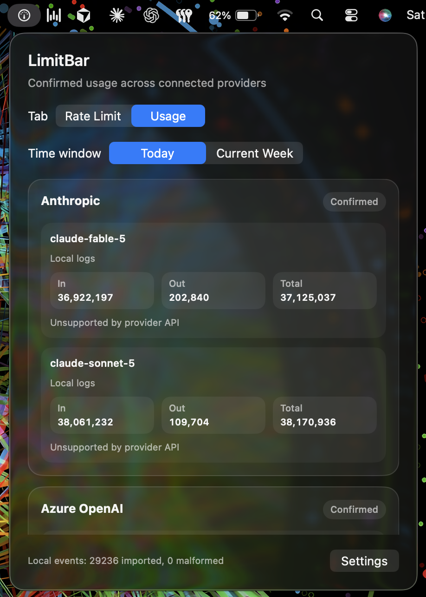
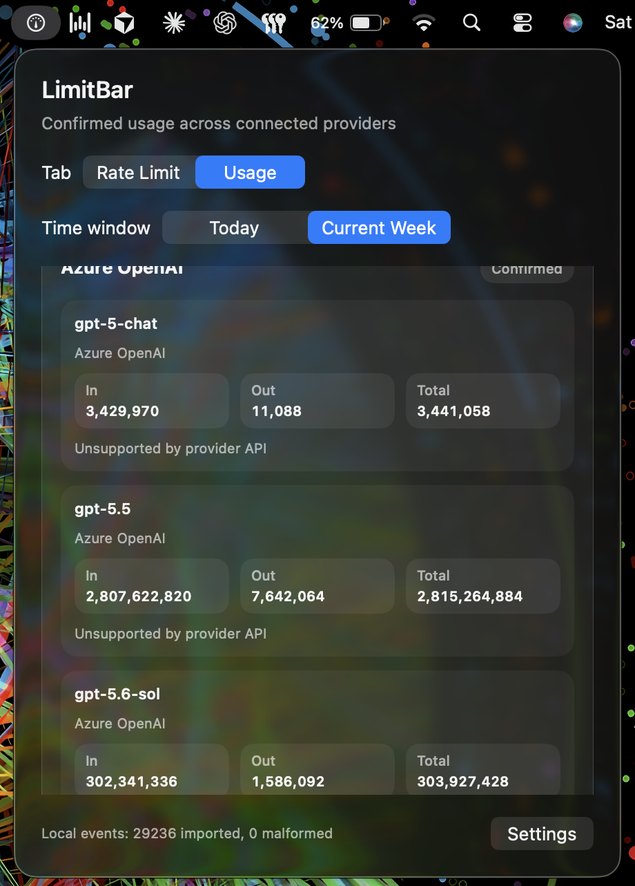

# LimitBar

A free, open-source macOS menu bar app for AI coding usage: Claude Code, Codex, Azure OpenAI, and OpenAI-compatible providers you configure. Everything runs locally — no account, cloud sync, or telemetry.

The menu bar gauge turns green, yellow, or red as your busiest rate limit fills up. Click it for two tabs:

- **Rate Limit** — percent used, remaining, and reset time for Claude Code and Codex.
- **Usage** — confirmed token counts and cost per provider and model, for Today or Current Week.


## Features

- **Claude Code** — session and weekly limits from your existing Keychain login.
- **Codex** — limits from local session logs; pooled team seats can show credits estimates when pricing is configured in Settings.
- **Usage tracking** — Anthropic, Azure OpenAI, and Codex from local CLI logs, with optional Admin API keys.
- **Cost labels** — provider-reported or calculated estimates, clearly marked.
- **Privacy-first** — credentials in Keychain, metrics in local SQLite, no prompts or telemetry stored.

## Prerequisites

- **macOS 14 (Sonoma) or later** — LimitBar is a native menu bar app and does not run on iOS, Linux, or Windows.
- **Xcode 16 or later** — required to build and run LimitBar from source (the core package targets Swift 6). There is no pre-built download yet; install Xcode from the Mac App Store, then open it once so command-line tools are set up.
- **Git** — to clone this repository.

Optional, for zero-setup rate limits: if you already use **Claude Code** (`claude`) or **Codex** (`codex`) on this Mac, the Rate Limit tab works immediately after launch — Claude from your existing Keychain login, Codex from local session logs at `~/.codex/sessions`.

## Run It

```sh
git clone https://github.com/talibilat/limit-bar.git
cd LimitBar
open LimitBar.xcodeproj
```

1. In the Xcode toolbar, choose the **LimitBar** scheme and destination **My Mac**.
2. Press **⌘R** (or click **Run**).
3. After the build finishes, the gauge icon appears in the menu bar (upper-right, near Wi‑Fi and battery). Click it to open the popover.
4. On first launch, macOS may ask to allow LimitBar to read the **Claude Code** Keychain item — approve if you want Claude rate limits without signing in again.

To stop the app while debugging, press **⌘.** in Xcode or quit LimitBar from the menu bar icon.

## Usage

**Rate Limit** reuses Claude Code's login and reads Codex limits from `~/.codex/sessions`. Reset times show a countdown under 24 hours, otherwise the weekday and time.

**Usage** shows one card per provider, broken down by model:





Confirmed usage can also be imported from `~/Library/Application Support/LimitBar/usage-events.jsonl` — the path is shown in Settings.

## Build & Test

```sh
DEVELOPER_DIR="/Applications/Xcode.app/Contents/Developer" swift test --package-path LimitBarCore
DEVELOPER_DIR="/Applications/Xcode.app/Contents/Developer" xcodebuild -project LimitBar.xcodeproj -scheme LimitBar -destination 'platform=macOS' build
```

## More Detail

See [`docs/QA.md`](docs/QA.md) for acceptance checks and verification notes.

---

Maintained by [Md Talib](https://github.com/talibilat) at Factor. If LimitBar is useful, star the repo or share it with your team.
