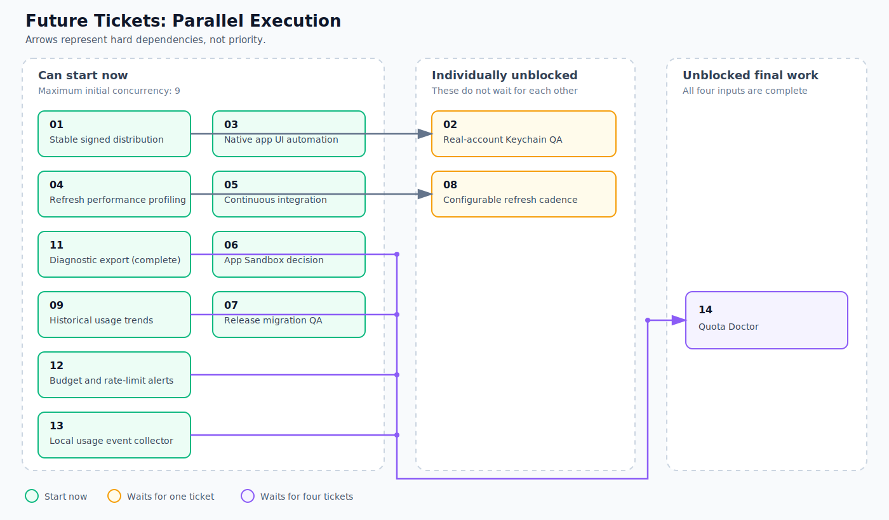

# Future Tickets

These documents are prioritized proposals, not product commitments, release promises, or approved architecture.
A filename containing `-d-` lists the ticket numbers that must be completed first.

## Priority Order

1. [`01-stable-signed-distribution.md`](01-stable-signed-distribution.md)
2. [`02-d-01-real-account-keychain-qa.md`](02-d-01-real-account-keychain-qa.md)
3. [`06-app-sandbox-file-access-decision.md`](06-app-sandbox-file-access-decision.md)
4. [`08-d-04-configurable-refresh-cadence.md`](08-d-04-configurable-refresh-cadence.md)
5. [`10-provider-health-refresh-history.md`](10-provider-health-refresh-history.md)
6. [`11-d-10-privacy-safe-diagnostic-export.md`](11-d-10-privacy-safe-diagnostic-export.md)
7. [`12-budget-rate-limit-alerts.md`](12-budget-rate-limit-alerts.md)
8. [`14-d-09-10-11-12-13-quota-doctor.md`](14-d-09-10-11-12-13-quota-doctor.md)

## Parallel Execution Graph

Priority order does not require serial execution.
An arrow means the ticket at its tail must be completed before the ticket at its head can start.
Tickets in the same group can run in parallel.

The current parallel set is tickets 01, 06, 08, 10, and 12.
Ticket 02 starts after ticket 01, and ticket 11 starts after ticket 10.
Ticket 14 starts after tickets 10, 11, and 12 are complete; tickets 04, 09, and 13 are already complete.

Every proposal must preserve the default local privacy boundary.
No proposal may collect or export raw prompts, code, model responses, terminal output, request bodies, credentials, or raw provider payloads.
